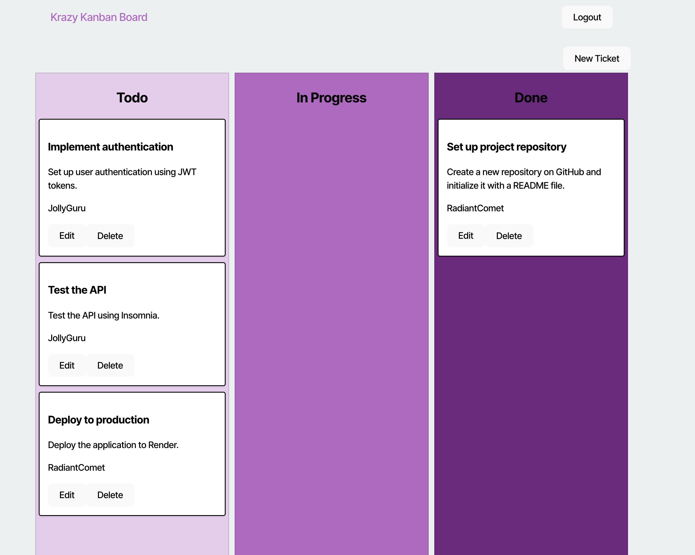

# Kanban-Board
The purpose is to build a Kanban Board app for product development 

# Description
The purpose of this project was to create a popular project management app "kanban." This will help organize individual or group projects. Adding JSON Web Token allow me secure the frontend of the app. This will ensure users are logged in before gaining access to the app. 

## Challenge
This challenge help me understand more about how important it is to utilize authentication with JSON Web Tokens (JWTs). This help avoid anyone from gaining access to your application without being authorized. My biggest challenge is when you first open the page, the logout button show at the top instead of the login page. I spent hours trying to figure out why but could not come up with a solution. As a result, users would have to click on logout and then they will be directed to login and gain access to the Kanban features. I look forward to coming back to this app and fixing this issue. 

 ## Table of Contents
  * [Installation](#installation)
  * [Usage](#usage)
  * [License](#license)
  * [Contributing](#contributing)
  * [Credits](#credits)
  * [Questions](#questions)
  

  ## Installation
  To install the necessary dependencies, run the following command:
  - npm install
  - npm run build 
  - npm run start:dev

  Other key dependencies to install in the package.json
  - bcrypt
  - dotenv
  - express
  - jsonwebtoken
  - pg
  - sequelize

  ## Usage
  
  ## Here is the main page
  
  CHeck out my deploy link here [Kanban Board](https://kanban-board-x17f.onrender.com)
  

  ## Credits 
  Starter code credit to Rutgers boot camp 

  ## License
  This project is license under MIT. 
    
    
    
    
  
  
  ## Contributing
  According to github, on learning how to contribute to someones repo, you can use a fork and pull request1. 
  Here is a link to the github documentation on how to fork and pull request: [Github Documentation](https://docs.github.com/en/get-started/exploring-projects-on-github/contributing-to-a-project)
  Since this is an open source project, check out the this link on contributor covenant: [Contributor Covenant](https://www.contributor-covenant.org/) This is a code of conduct for open source projects.
  

  
  ## Questions
  If you have any questions about this repo, please contact me directly at marqueljamal12@gmail.com. You can find more of my work on github at [marquel12](https://github.com/marquel12/Kanban-Board) 